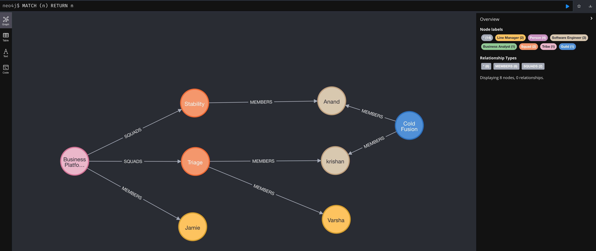

# Description

> **tolkein** - because all this talk of Guilds and Tribes gives me the fantasy shivers.

I wanted a way (not a Spreadsheet) to very quickly create a Spotify Team model. At work I have to resource Squads
with different profiles and resource needs so I often find myself asking questions such as:

- who has Java experience but has worked with X or Y person recently
- who is the Payments team could be supported to work on ColdFusion code based on close working relationships with an 
experienced developer

Goals where:
- explore the benefits of a GraphDB to map relationships rather than entities
- explore SpringDataRest a bit more - i.e. how can repository methods be customised to create something a bit better 
than what you get from the  "out the box" configuration
- write the whole thing in Kotlin to get a sense of how different it is for SpringBoot
- use Gradle as the build (because why not if you are going to be experimenting)

# Installation

``./gradlew bootRun``

# Usage

What do you want me to tell you? It's a HATEOS REST API - ``curl`` away