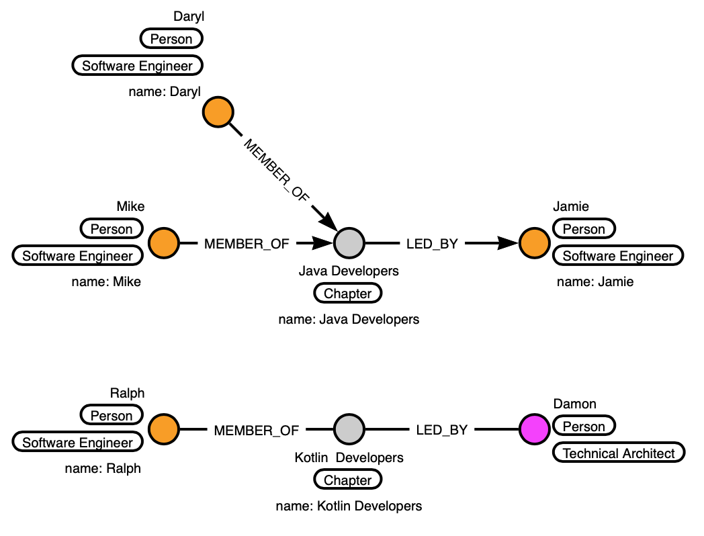

# Description

 <em>tolkien
</em> ... because all this talk of Guilds and Tribes makes me think of Hobbits.

Like all organisations, we love a transformation, don't we? The latest flavour is the **Spotify Model**.

I needed to quickly create a tool that enabled me to manage my engineering resources and to satisfy demands for 
specific resource profiles from stakeholders. My hypothesis (proof of which is one of the goals of this project) was 
that a Graph database would be a good fit. I wanted to move beyond simply assigning resources on a **java developer 
goes here**-basis, to something more sophisticated like **which developer with java skill set has the closest 
relationship proximity to other members of a given squad**.

The goals of the project are:

- explore the benefits of a Graph database to map entities and relationships in a Spotify model
- explore SpringDataRest as a means of transforming a Graph model into a REST interface 
- write the whole thing in Kotlin to see how it works in the Spring ecosystem
- use Gradle as the build tool (because why not if you are going to be experimenting)

## The Data Model - GraphDB

Some example use cases (queries):

- Which skills do a squad currently have?
- Which people have given skill?
- Which person with a given skill has a previous relationship with a member of a given squad?
- Which member of a given squad has a previous relationship with a person with a given skill?

### The basics...

My first aim was to capture the basic entities of the Spotify model

- ``Person``
- ``Squad``
- ``Tribe``
- ``Guild``
- ``Chapter``

At the root of the model is the Entity ``Person``. 

A ``Person`` can be a ``MEMBER_OF`` a ``Squad``, which in turn is ``PART_OF`` a ``TRIBE``.

In addition to members, a ``Squad`` will have a dedicated ``PRODUCT_OWNER``; a ``Tribe`` will have a dedicated 
``TRIBE_LEAD``.

In the Spotify model, the ``Squad`` is an autonomous organisational unit. However, members will each have their own 
job ``Chapter`` that they ``BELONG_TO``. A ``Chapter`` is responsible for technical leadership and engineering standards 
for a specific job and will be ``LED_BY`` a senior technical resource.

A ``Guild`` is a community of interest for a particular technology or topic. Any ``Person`` can become a 
``CONTRIBUTOR TO`` to a ``Guild`` and there is no formal structure except for a ``COORDINATOR``.

### Next level...

- Which skills do a squad currently have?
- Which people have given skill?

In order to answer questions about which skills a person has, I created a ``Skill`` entity for each skill and then added
appropriate relationships.

# Installation

``./gradlew bootRun``

# Usage

What do you want me to tell you? It's a HAL-based REST API - ``curl`` away!